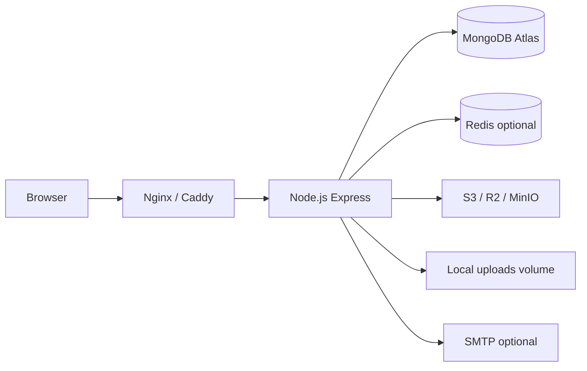

# Deployment guide — Student Complaint Portal

## Architecture



In production, Express serves the built React SPA (`client/dist`), the REST API (`/api/*`), WebSocket (`/socket.io`), and uploaded files (`/uploads` or S3 presigned URLs).

## Prerequisites

- Node.js 18+
- MongoDB (Atlas recommended for production)
- A strong `JWT_SECRET` (32+ random characters)
- HTTPS termination (Nginx, Caddy, or your PaaS)

## Environment variables

| Variable | Required (prod) | Description |
|----------|-----------------|-------------|
| `NODE_ENV` | Yes | Set to `production` |
| `PORT` | No | Default `5000` |
| `MONGODB_URI` | Yes | MongoDB connection string |
| `JWT_SECRET` | Yes | Signing key for JWT — never use defaults in prod |
| `JWT_EXPIRES_IN` | No | Default `7d` |
| `CLIENT_URL` | Yes | Public app URL (CORS + Socket.io), e.g. `https://complaints.example.edu` |
| `TRUST_PROXY` | No | Set `true` behind reverse proxy |
| `RATE_LIMIT_*` | No | See `server/.env.example` |
| `STORAGE_PROVIDER` | No | `local` (default) or `s3` |
| `S3_BUCKET`, `S3_REGION`, `S3_ACCESS_KEY`, `S3_SECRET_KEY` | If `s3` | Object storage for attachments |
| `S3_ENDPOINT`, `S3_FORCE_PATH_STYLE` | No | For MinIO, Cloudflare R2, etc. |
| `REDIS_URL` | No | Enables Socket.io Redis adapter for multi-instance |
| `SMTP_*` | No | Email + password reset; logs to console if unset |

Client build (only if API is on a **different origin**):

| Variable | Description |
|----------|-------------|
| `VITE_API_URL` | API base URL |
| `VITE_SOCKET_URL` | Socket.io URL (usually same as API) |

Leave both empty when the SPA and API are same-origin (Docker or Express static serving).

## Option A — Docker Compose (quickest)

1. Create a `.env` file in the project root:

   ```env
   JWT_SECRET=your-long-random-secret-here
   CLIENT_URL=http://localhost:5000
   PORT=5000
   ```

2. Build and run:

   ```bash
   docker compose up --build
   ```

3. Open `http://localhost:5000`. API health: `GET /api/health`.

4. Seed data (dev/demo only — run against the compose MongoDB):

   ```bash
   npm run seed
   ```

**Note:** Uploads persist in the `uploads` Docker volume. For multi-instance deployments, move to S3-compatible object storage.

## Option B — VPS with Node.js

1. Install Node 20, MongoDB (or use Atlas), and Nginx.

2. Clone the repo and install:

   ```bash
   npm install
   cd server && npm install && cd ../client && npm install
   ```

3. Configure `server/.env` (copy from `server/.env.example`).

4. Build and start:

   ```bash
   npm run build
   set NODE_ENV=production   # Linux/macOS: export NODE_ENV=production
   npm start
   ```

5. Point Nginx at `http://127.0.0.1:5000` with WebSocket upgrade support:

   ```nginx
   location / {
     proxy_pass http://127.0.0.1:5000;
     proxy_http_version 1.1;
     proxy_set_header Upgrade $http_upgrade;
     proxy_set_header Connection "upgrade";
     proxy_set_header Host $host;
     proxy_set_header X-Real-IP $remote_addr;
     proxy_set_header X-Forwarded-For $proxy_add_x_forwarded_for;
     proxy_set_header X-Forwarded-Proto $scheme;
   }
   ```

6. Enable HTTPS (Let's Encrypt via Certbot or Caddy automatic TLS).

7. Set `TRUST_PROXY=true` and `CLIENT_URL=https://your-domain`.

## Option C — Render (recommended PaaS)

See **[RENDER.md](RENDER.md)** for the full guide (Atlas + R2/S3 + blueprint).

Quick summary:

1. Push repo to GitHub → Render **Blueprint** (uses `render.yaml`).
2. Set `MONGODB_URI` (Atlas) and `S3_*` (R2 or AWS) in the dashboard.
3. `CLIENT_URL` is auto-set via `RENDER_EXTERNAL_URL`; override only for custom domains.
4. Health check: `/api/health`.

## Option D — Other PaaS (Railway, Fly.io)

1. Deploy as a **single web service** running `npm start` after `npm run build`.
2. Set env vars (`MONGODB_URI`, `JWT_SECRET`, `CLIENT_URL`, `NODE_ENV=production`).
3. Use object storage (S3/R2) — not local disk.
4. Use MongoDB Atlas for the database.

## Post-deploy checklist

- [ ] `JWT_SECRET` is unique and not committed
- [ ] `CLIENT_URL` matches the public HTTPS URL
- [ ] `/api/health` returns `{ ok: true, db: "connected" }`
- [ ] Student login, complaint submission, attachment upload work
- [ ] Admin status update triggers real-time toast/list refresh
- [ ] PDF export downloads correctly
- [ ] SMTP tested (or console logging accepted)
- [ ] **Do not** run `npm run seed` in production unless creating initial demo data intentionally
- [ ] Create first super admin via seed (dev) or `AdminRegister` route (super_admin only)

## Security features enabled

- Helmet security headers
- Rate limiting on `/api` and auth routes
- Env validation at startup (production fails fast without secrets)
- No stack traces in production API errors
- Graceful shutdown on SIGTERM/SIGINT
- bcrypt password hashing, JWT role verification against DB

## Rollback

- **Docker:** `docker compose down` and redeploy previous image tag.
- **VPS:** Keep previous `client/dist` and `server/` backup; restore and restart with `npm start`.
- **Database:** Use MongoDB Atlas point-in-time restore for data rollback.

## S3 attachment storage

Set `STORAGE_PROVIDER=s3` and configure bucket credentials. Works with AWS S3, Cloudflare R2, or MinIO (`S3_ENDPOINT` + `S3_FORCE_PATH_STYLE=true`).

Attachments are stored under `complaints/` in the bucket. API responses include presigned download URLs (1 hour). Authenticated fallback: `GET /api/files/{key}`.

## Redis (Socket.io scaling)

Set `REDIS_URL=redis://host:6379` when running **multiple app instances** behind a load balancer. Docker Compose includes a Redis service and wires it automatically.

Single-instance deployments can omit `REDIS_URL` (in-memory adapter).

## CI/CD

GitHub Actions workflow (`.github/workflows/ci.yml`) runs on push/PR:

1. `npm test` in `server/` (integration tests via `mongodb-memory-server`)
2. `npm run build` in `client/`
3. `docker build` smoke check

Run tests locally:

```bash
npm test
```

## Password reset

Requires SMTP (or check server logs in dev). Flow:

1. `POST /api/auth/forgot-password` `{ "email": "..." }`
2. User opens link from email → `/reset-password?token=...&email=...`
3. `POST /api/auth/reset-password` `{ email, token, password }`

Works for students and admins (email-based accounts).

## Recommended next steps

- SSO / institutional LDAP integration
- Email verification on registration
- ClamAV hook for uploaded files
